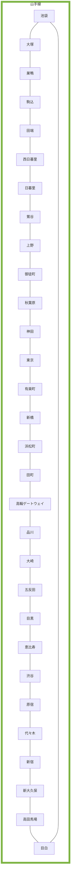

```mermaid
flowchart TB
    subgraph 山手線
        direction TB

        池袋 --- 大塚
        大塚 --- 巣鴨
        巣鴨 --- 駒込
        駒込 --- 田端
        田端 --- 西日暮里
        西日暮里 --- 日暮里
        日暮里 --- 鶯谷
        鶯谷 --- 上野
        上野 --- 御徒町
        御徒町 --- 秋葉原
        秋葉原 --- 神田
        神田 --- 東京
        東京 --- 有楽町
        有楽町 --- 新橋
        新橋 --- 浜松町
        浜松町 --- 田町
        田町 --- 高輪ゲートウェイ
        高輪ゲートウェイ --- 品川
        品川 --- 大崎
        大崎 --- 五反田
        五反田 --- 目黒
        目黒 --- 恵比寿
        恵比寿 --- 渋谷
        渋谷 --- 原宿
        原宿 --- 代々木
        代々木 --- 新宿
        新宿 --- 新大久保
        新大久保 --- 高田馬場
        高田馬場 --- 目白
        目白 --- 池袋
    end

    style 山手線 fill:#ffffff,stroke:#7CB342,stroke-width:8px
```
